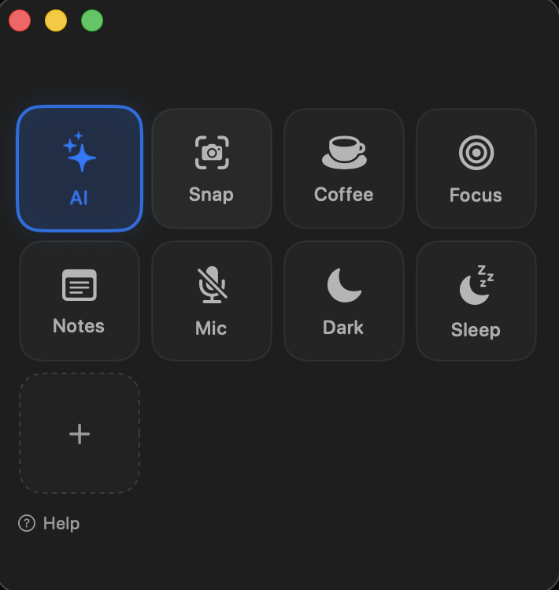

# Bento

A minimal, fun, open-source soft Stream Deck for macOS. No hardware. No subscription. No telemetry.

> Press `⌃⌘B` from anywhere — eight tiles appear. Click one — magic happens.



## Install

**Recommended — one line, no Gatekeeper dance:**

```bash
npm install -g bento
```

That installs `Bento.app` to `/Applications` and a `bento` CLI to `/usr/local/bin/bento`. The postinstall strips the quarantine flag so the ad-hoc-signed binary launches without the "from an unidentified developer" prompt.

**Or download the DMG** from the [Releases page](https://github.com/ryan-alberts/bento/releases/latest), drag to Applications, then right-click → Open the first time.

**Or build from source** (requires Xcode Command Line Tools, ~1 GB; or full Xcode for the test target):

```bash
git clone https://github.com/ryan-alberts/bento.git
cd bento
./scripts/build-app.sh release
open build/Bento.app
./scripts/install-cli.sh   # optional: symlink `bento` to /usr/local/bin
```

## Why

Stream Deck Mobile is locked to iOS. Mosaic and Quadro are skeuomorphic and largely abandoned. Raycast script-commands are great but modal — they vanish when you act. There was room for a small native Mac app whose only job is "press a tile, run a thing", with the same hot-key + Hammerspoon + Shortcuts hooks a power user already lives in.

It is deliberately a tiny app. One window, one editor sheet, one CLI binary, one global hotkey. ~1.4 MB compiled. The whole codebase is ~1 400 lines of Swift you can read in an afternoon.

## What ships in the default deck

| Tile       | What it does                                                                   | Permission |
|------------|--------------------------------------------------------------------------------|------------|
| **Dark**   | Toggle macOS Dark Mode on/off.                                                 | Asks once for Automation (System Events) |
| **Lock**   | Lock the screen and require your password on wake.                             | None |
| **Mic**    | Toggle the system mic mute. Tile glows red when muted. Live state.             | Asks once for Automation (System Events) |
| **Coffee** | Stop your Mac from sleeping for 60 minutes. Live ring traces the countdown.    | None |
| **Snap**   | Interactive screenshot — drag a region, PNG saves to your Desktop.             | None |
| **Notes**  | Open the macOS Notes app. (Edit to point at your favorite note app.)           | None |
| **Sleep**  | Put your displays to sleep right now (doesn't sleep the whole Mac).            | None |
| **Focus**  | 25-minute focus session — Mac stays awake, sound + notification when done.     | None |

Hover any tile in the app to see this same one-line description. Open **Help → Bento Help** in the menu bar for the full tour.

You can edit, remove, or reorder any of them. None are sacred.

## How it behaves like a real Mac app

Bento ships as a **regular macOS app**, not a menu bar utility:

- **Dock icon** — bento-box themed, appears in your Dock like any other app
- **Standard menu bar** at the top of the screen: App / File / Edit / View / Window / Help
- **Traffic-light close button** on the window — clicking the red **X hides the panel** (Bento stays in your Dock so `⌃⌘B` still re-summons it). To quit fully: `⌘Q` or App menu → Quit Bento
- **Mission Control + Spaces + hot corners** all work normally. The window respects `⌘+H` to hide, `⌘+M` to minimize
- **Cmd+Tab** brings Bento forward like any other app
- **`⌃⌘B` global hotkey** summons the window from any app — even when Bento is hidden or behind other apps

## Customize

**The 60-second tutorial:**
1. Click the `+` tile. Form opens.
2. Pick a label, an SF Symbol name (e.g. `bolt.fill`, `wifi`, `cloud.rain`), a tint, an action type (Launch app / Open URL / Run shell), and a payload.
3. Save.

The shell action is the universal escape hatch. Anything you can write in zsh works:

```bash
osascript -e 'tell application "Music" to next track'
shortcuts run "Lights Off"
hs -c 'hs.window.focusedWindow():maximize()'
curl -X POST https://hooks.slack.com/services/...
```

**Edit `deck.json` directly:** `~/Library/Application Support/Bento/deck.json`. The app hot-reloads via FSEvents within a second of save. Schema is documented in [docs/schema.md](docs/schema.md).

**Sync across machines:** the CLI exports and imports plain JSON, so you can keep your deck in your dotfiles repo:

```bash
bento export > ~/dotfiles/bento-deck.json
bento import < ~/dotfiles/bento-deck.json
```

## Integrations

| Trigger source     | How to fire a tile                                  |
|--------------------|-----------------------------------------------------|
| **Global hotkey**  | `⌃⌘B` toggles the panel                             |
| **CLI**            | `bento press dark`                                  |
| **URL scheme**     | `open 'bento://press/dark'`                         |
| **Hammerspoon**    | `hs.execute("/usr/local/bin/bento press dark")`     |
| **Shortcuts**      | "Run Shell Script" → `/usr/local/bin/bento press dark` |
| **Karabiner**      | Bind a key chord → run `/usr/local/bin/bento press dark` |
| **Stream Deck Mobile** | Use the "Open URL" action with `bento://press/dark` |

See [docs/hammerspoon-recipes.md](docs/hammerspoon-recipes.md) for ready-to-paste examples.

## Recipes

The [`recipes/`](recipes/) directory holds community-contributed tile fragments. PRs to `recipes/` are fast-merged — they don't touch app code. If you build a tile worth sharing, drop the JSON in there.

## Privacy

- No telemetry
- No analytics
- No accounts
- No network calls (other than the npm postinstall download from this GitHub release)
- No background phone-home

`grep -r "URLSession\|http" Sources/` returns nothing in the app code.

## Architecture

A short tour of the codebase:

| Where                                        | What                                                           |
|----------------------------------------------|----------------------------------------------------------------|
| `Sources/Bento/BentoApp.swift`               | App entry, menu bar, URL scheme, FSEvents wiring               |
| `Sources/Bento/PanelController.swift`        | `NSPanel` + `NSHostingView` bridge, glass material, multi-display |
| `Sources/Bento/Models/`                      | `Tile`, the `Action` protocol, three concrete actions          |
| `Sources/Bento/Storage/`                     | `DeckStore` (Codable JSON) + `DeckWatcher` (FSEvents hot-reload) |
| `Sources/Bento/Views/`                       | SwiftUI: `DeckView`, `TileView`, `TileEditor`, `ConfettiView`   |
| `Sources/Bento/LiveState/`                   | `CaffeinateMonitor`, `MicMonitor` — power the live tiles       |
| `Sources/Bento/Hotkey/GlobalHotkey.swift`    | Carbon `RegisterEventHotKey` for `⌃⌘B`                         |
| `Sources/BentoCLI/main.swift`                | The `bento` CLI; talks to the running app via Distributed Notifications |
| `npm/`                                       | The `bento` npm package (postinstall downloads this GitHub release) |
| `scripts/build-app.sh`                       | Wraps the SPM-built binary into `Bento.app`                    |
| `scripts/build-zip.sh` / `build-dmg.sh`      | Release artifacts                                              |

Why SPM and not Xcode? It builds with just Command Line Tools (~1 GB instead of 15 GB), the repo is text-only (no `.pbxproj` merge conflicts), and CI is faster. Open the `Package.swift` in Xcode anytime if you want previews or breakpoints.

## Requirements

- macOS 14 (Sonoma) or later
- Xcode Command Line Tools (`xcode-select --install`) for building from source
- Node 18+ for the npm install path

## Contributing

See [CONTRIBUTING.md](CONTRIBUTING.md). Recipe PRs get fast-merged.

## Coming in v0.2

- **Macro recording** — record cursor moves, clicks, and keystrokes; play them back from a tile. Most-requested Stream Deck feature outside of OBS scenes; needs Accessibility permission, which is why it's not in v0.1.
- **Auto-update via Sparkle** so you don't have to `npm update -g bento` to get fixes.
- **Configurable global hotkey** with a key-recorder UI (v0.1 hardcodes `⌃⌘B`).
- **Play / media-key tile** — needs a proper `IOHIDPostEvent` bridge to send media keys without triggering the "control your computer" Accessibility prompt. Removed from v0.1 defaults until that ships safely.
- **Universal binary** (arm64 + x86_64). v0.1 is arm64-only.
- **XCTest target** — comes back alongside a library-target refactor that needs full Xcode (Command Line Tools doesn't ship XCTest).
- **Homebrew tap** as a fourth install path.

## Security review (what each default tile actually asks for)

| Tile  | Triggers prompt? | Which prompt |
|-------|------------------|--------------|
| Dark  | Yes, once        | "Bento wants permission to control System Events" (Automation) |
| Mic   | Yes, once        | Same Automation prompt |
| Lock  | No               | Uses macOS's built-in `CGSession -suspend` |
| Coffee, Focus | No       | Built-in `caffeinate` |
| Snap  | No               | Built-in `screencapture` |
| Notes | No               | Just `open -a Notes` |
| Sleep | No               | Built-in `pmset displaysleepnow` |

**No default tile triggers the "Bento wants to control your computer" Accessibility prompt.** That prompt comes from sending keystrokes via `osascript ... key code` or similar. If you build a custom tile that does that, expect the prompt — and decide whether you want to grant it.

## License

MIT — see [LICENSE](LICENSE).
